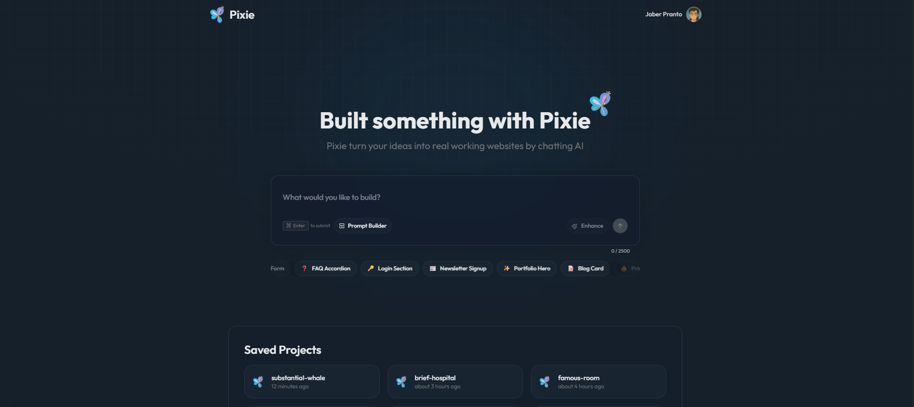

# Pixie



Pixie is a SaaS-style, chat-driven website builder: describe what you want to build, and Pixie generates a working Next.js app in a live sandbox—complete with a shareable preview URL and browsable source code.

Under the hood, Pixie orchestrates an AI “code agent” that runs inside an isolated E2B sandbox, writes/updates files, executes safe terminal commands, and streams real-time progress back to the UI.

## What Pixie Does

Pixie turns natural language into runnable web apps.

You can:

- Start a new project with a single prompt.
- Continue iterating via chat (follow-ups update the existing generated project).
- Preview the app instantly in an embedded iframe (or open the sandbox URL in a new tab).
- Explore generated source files directly in the app.
- Make “visual edits” by clicking an element in the preview, then telling Pixie how to modify it.

Pixie is built around **projects** and **generation fragments**:

- A **Project** is your persistent workspace.
- Each assistant response can include a **Fragment**: a sandbox URL + a snapshot of generated files.

## Core Workflow

1. **Create a project** from the homepage prompt.
2. Pixie consumes **usage credits** and triggers a background generation job.
3. The UI shows a **live “what’s happening” timeline** (reading files, creating/updating files, running commands, fetching images, etc.).
4. When complete, Pixie will inform you via a live link
5. You can:
   - Switch between **Demo** (preview) and **Code** (file explorer)
   - Send follow-up instructions to iterate

## Product Features & Capabilities

Pixie is built for fast, repeatable “idea → live app” loops:

- **Chat to build**: start from a prompt, then iterate with follow-ups.
- **Spec-first UX (USP)**: enhance prompts or generate a structured blueprint before you build.
- **See it instantly**: live sandbox preview + generated code side-by-side.
- **Edit precisely**: click an element in the preview and tell Pixie what to change.
- **Know what’s happening**: real-time generation timeline.

### 1) Project Workspace

- **Saved projects** per user.
- One workspace with **Chat + Demo + Code**.

### 2) Prompt Enhancer (AI Assisted Spec Writing)

Before generating, users can improve their prompt into a clearer spec with different enhancement styles:

- Balanced
- Developer
- Product Manager
- Designer

This runs as a separate AI call (distinct from the code-generation agent).

### 3) Prompt Builder (Taste + Layout Blueprint)

For users who want more guidance than free-form prompting, Pixie offers a Blueprint builder:

- Choose a **taste profile** (vibe/design-system guidance)
- Optionally choose a **layout archetype**
- Add custom instructions

Pixie packages this blueprint as structured JSON, which the code agent can use to produce more consistent UI.

### 4) Chat-Based Building & Iteration

- Start from a prompt, then refine with follow-up messages.
- Follow-ups **build on the last generated files** (no “start over” resets).

### 5) Visual Edit Mode (Element Picker)

- Toggle **Visual edits** in the preview and click an element.
- Pixie captures selector + context and prepends it to your next instruction.
- Great for targeted tweaks like typography, copy, spacing, and component changes.

### 6) Live Preview in a Secure Sandbox

- Generated apps run in an isolated E2B sandbox.
- Preview in-app via iframe, with **refresh / copy URL / open new tab**.

### 7) Built-in Code Explorer

- File tree + code viewer for generated output.
- Copy any file’s contents to clipboard.

### 8) Real-Time Generation Updates (User Trust)

- Live timeline: sandbox init, context restore, reads/writes, terminal runs, summary.
- Delivered to the client via Inngest Realtime subscriptions.

### 9) Templates for Fast Starts

The homepage includes quick-start project templates (prewritten prompt snippets) so users can get started immediately.

### 10) SaaS Billing & Usage Limits (Credits)

Pixie enforces usage limits with a credit system:

- **Free tier**: 5 credits per 30 days
- **Pro tier**: 100 credits per 30 days
- Each generation consumes 1 credit (project creation and each follow-up message)

Plans are evaluated via Clerk, and the UI shows remaining credits + reset timing.

When a user is out of credits, Pixie directs them to the Pricing page.

## How It Works (Architecture Overview)

### High-Level Components

- **Next.js App Router UI**: homepage, auth pages, pricing, project workspace.
- **tRPC API layer**: typed procedures for projects, messages, AI tools, and usage status.
- **Postgres + Prisma**: persists projects, chat messages, generation fragments, and rate-limit usage records.
- **Inngest**: background job orchestration for code generation.
- **Inngest Realtime**: streams generation events to the client.
- **E2B Sandbox**: executes generated Next.js apps in isolated environments.

### Data Model (Prisma)

- `Project`: user-owned container for messages.
- `Message`: chat history (`USER` / `ASSISTANT`) and status (`RESULT` / `ERROR`).
- `Fragment`: saved generation output (sandbox URL, title, files JSON snapshot).
- `Usage`: backing store for rate-limiting credits.

### Generation Flow

1. User triggers `projects.create` (new project) or `messages.create` (follow-up).
2. Server consumes credits (`consumeCredits`).
3. Server sends an Inngest event: `code-agent/run`.
4. Inngest function:
   - Creates an E2B sandbox (template: `pixie`)
   - Loads the last known file snapshot (if follow-up) back into the sandbox
   - Runs an AI agent loop that can:
     - Read targeted files
     - Create/update files
     - Run terminal commands
     - Optionally fetch images (Unsplash tool)
   - Injects a small element-picker script for Visual Edit mode
   - Generates a summary + fragment title
   - Saves an assistant message + fragment (URL + files) to Postgres
   - Publishes real-time progress events throughout

## Tech Stack

### Product / UI

- Next.js 15 (App Router) + React 19
- TypeScript
- Tailwind CSS
- shadcn/ui + Radix UI primitives
- TanStack React Query
- tRPC v11

### Auth, Billing, and Access Control

- Clerk for authentication and pricing
- Plan gating via Clerk

### Backend / Data

- Prisma ORM
- PostgreSQL

### AI + Orchestration

- Inngest (background jobs)
- Inngest Realtime (client subscriptions)
- E2B Code Interpreter sandboxes
- OpenAI SDK for AI workflow

### Optional Media Tooling

- Unsplash API integration for asset fetching inside the sandbox

## Repository Structure

- `src/app` — App Router routes (home, auth, pricing, projects, API routes)
- `src/modules/*` — Feature modules
  - `home` — project creation UI + templates + prompt tools
  - `projects` — project workspace UI
  - `messages` — chat persistence + generation triggers
  - `usage` — credit system + rate limiting
  - `ai` — prompt enhancement
- `src/ingest/*` — Inngest + AgentKit code generation pipeline
- `prisma/` — schema + migrations
- `public/` — product assets (logos, hero image)
- `sandbox-templates/` — E2B template config (Next.js + shadcn bootstrap)

## Local Development

### Prerequisites

- Node.js (recommended: 20+)
- Postgres database
- Clerk application (keys)
- Inngest CLI (the repo uses `npx inngest-cli@latest dev`)
- OpenAI API key
- (Optional) Unsplash Access Key

### 1) Install Dependencies

```bash
pnpm install
```

### 2) Configure Environment Variables

Create a `.env` file in the project root.

Copy the contents from `.env.example` file to `.env` file

### 3) Database

```bash
pnpm run db:migrate
pnpm run db:studio
```

### 4) Run the App

```bash
pnpm run dev
```

App: http://localhost:3000

### 5) Run Inngest Dev Server

In a second terminal:

```bash
pnpm run inngest
```

This enables the generation pipeline to execute and stream real-time progress.

## Scripts

```bash
pnpm run dev        # Next.js dev (Turbopack)
pnpm run build      # Production build
pnpm run start      # Start production server
pnpm run lint       # ESLint

pnpm run db:migrate # Prisma migrate dev
pnpm run db:studio  # Prisma Studio

pnpm run inngest    # Inngest dev server
```

## Troubleshooting

### Pricing / Upgrade Loop

If you get redirected to `/pricing`, you likely hit the credit limit.
Confirm the user has the `pro_user` plan in Clerk, or wait for credits to reset.

### tRPC calls failing on server

If server-side calls fail, confirm `NEXT_PUBLIC_APP_URL` is set correctly (e.g. `http://localhost:3000`).

### Inngest generation not running

- Ensure `pnpm run inngest` is running.
- Ensure `OPENAI_API_KEY` is set.
- Ensure your Postgres DB is reachable and migrated.
